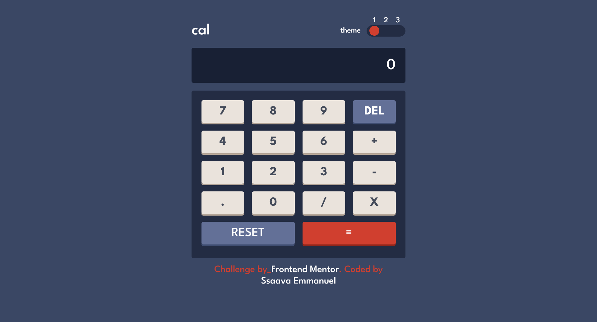

# Frontend Mentor - Calculator app solution

This is a solution to the [Calculator app challenge on Frontend Mentor](https://www.frontendmentor.io/challenges/calculator-app-9lteq5N29). Frontend Mentor challenges help you improve your coding skills by building realistic projects.

## Table of contents

- [Overview](#overview)
  - [The challenge](#the-challenge)
  - [Screenshot](#screenshot)
  - [Links](#links)
- [My process](#my-process)
  - [Built with](#built-with)
  - [What I learned](#what-i-learned)
  - [Continued development](#continued-development)
  - [Useful resources](#useful-resources)
- [Author](#author)
- [Acknowledgments](#acknowledgments)

## Overview

### The challenge

Users should be able to:

- See the size of the elements adjust based on their device's screen size
- Perform mathmatical operations like addition, subtraction, multiplication, and division
- Adjust the color theme based on their preference
- **Bonus**: Have their initial theme preference checked using `prefers-color-scheme` and have any additional changes saved in the browser

### Screenshot



### Links

- Solution URL: [Add solution URL here](https://github.com/Ssaava/calculator-app/tree/main)
- Live Site URL: [Add live site URL here](https://calculator-app-6aw.pages.dev/)

## My process

### Built with

- Semantic HTML5 markup
- CSS custom properties
- Flexbox
- [sass](https://sass-lang.com/) - CSS Preprocessor
- [npm](https://nodejs.org/en) - Package Manager
- [Vite](https://vitejs.dev/) - Build Tool
- [React](https://reactjs.org/) - JS library

### What I learned

Use this section to recap over some of your major learnings while working through this project. Writing these out and providing code samples of areas you want to highlight is a great way to reinforce your own knowledge.

I am really excited to use React in this project due to the power of React Components

```html
<main className="{`main" ${userMode}`}>
  <div className="container">
    <header toggleMode="{toggleMode}" />
    <Screen value="{currentValue}" />
    <ButtonsCase handleClick="{handleClick}" />
    <div className="author">
      Challenge by_
      <a
        href="https://www.frontendmentor.io?ref=challenge"
        target="_blank"
        rel="noreferrer"
      >
        Frontend Mentor
      </a>
      . Coded by <br />
      <a href="https://twitter.com/ssava_ema" target="_blank" rel="noreferrer">
        Ssaava Emmanuel
      </a>
    </div>
  </div>
</main>
```

```scss
// Used the following sass mixin to ease the creation of flex containers
@use "functions" as f;
@mixin flex($gap: 0, $wrap: no-wrap) {
  display: flex;
  justify-content: space-between;
  align-items: center;
  gap: f.rem($gap);
  flex-wrap: $wrap;
}

// created on function in sass to convert pixels to rems. the power of sass functions
@use "sass:math" as m;
@function rem($value) {
  @if m.is-unitless($value) {
    @return m.div($value, 16) + rem;
  } @else {
    @error "Please remove units from number";
  }
}
```

```js
// proud of React useEffect() and useState() hooks that enable updating the site content without refreshing
const [currentValue, setCurrentValue] = new useState([0]);
const [userMode, setUserMode] = new useState("");
useEffect(() => {
  const themeMode = localStorage.getItem("mode") || "";
  setUserMode(themeMode);
});
```

### Continued development

Use this section to outline areas that you want to continue focusing on in future projects. These could be concepts you're still not completely comfortable with or techniques you found useful that you want to refine and perfect.

**Note: Delete this note and the content within this section and replace with your own plans for continued development.**

### Useful resources

- [Example resource 1](https://www.example.com) - This helped me for XYZ reason. I really liked this pattern and will use it going forward.
- [Example resource 2](https://www.example.com) - This is an amazing article which helped me finally understand XYZ. I'd recommend it to anyone still learning this concept.

**Note: Delete this note and replace the list above with resources that helped you during the challenge. These could come in handy for anyone viewing your solution or for yourself when you look back on this project in the future.**

## Author

- Website - [Add your name here](https://www.your-site.com)
- Frontend Mentor - [@yourusername](https://www.frontendmentor.io/profile/yourusername)
- Twitter - [@yourusername](https://www.twitter.com/yourusername)

**Note: Delete this note and add/remove/edit lines above based on what links you'd like to share.**

## Acknowledgments

This is where you can give a hat tip to anyone who helped you out on this project. Perhaps you worked in a team or got some inspiration from someone else's solution. This is the perfect place to give them some credit.

**Note: Delete this note and edit this section's content as necessary. If you completed this challenge by yourself, feel free to delete this section entirely.**
